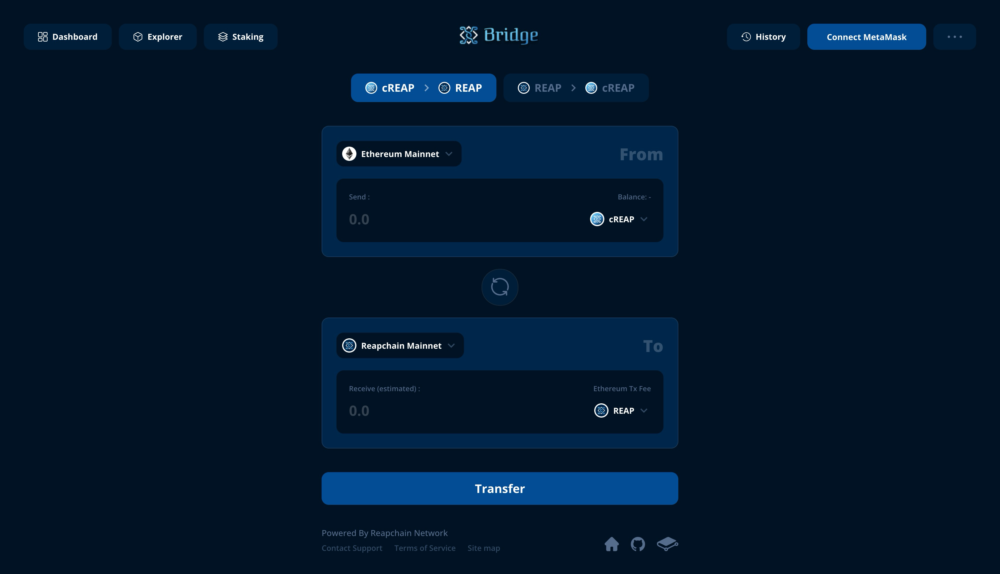

# Bridge

The Reapchain Bridge provides two important features:

* Convert classic REAP(ERC-20) to REAP with MetaMask wallet
* Convert REAP to classic REAP with Keplr wallet

Link : [https://bridge.reapchain.org](https://bridge.reapchain.org/bridge/token)

<figure><figcaption></figcaption></figure>

### How To Use

#### Convert to REAP

1. Click the cREAP to REAP button.
2. Click the "Connect MetaMask" button at the top right to connect with your MetaMask wallet.
3. In MetaMask, the network of choice is Ethereum Mainnet.
4. To convert cREAP to REAP, you need enough cREAP and ETH to pay the fee.
5. Enter the amount to send in the from side and click the Transfer button.
6. If this is your first time using this account, you must first send an Approve transaction to allow the reapchain bridge to convert your cREAP to REAP. \
   This approve transaction is required only once, and once you are registered on the network, you do not need to send an approve transaction thereafter.
7. Wait for the approve transaction to be registered on the network, then click the Transfer button again.
8. In the pop-up window that opens, confirm the amount you are sending and receiving. If an account other than this account needs to receive REAP, check the "Set optional recipient address" button and enter the recipient address.
9. Click the "Send Transaction" button and sign the transaction using MetaMask.
10. After the transaction is successfully sent, wait for the result.

#### Convert to classic REAP

1. Click the REAP to cREAP button.
2. Click the "Connect Keplr" button at the top right to connect with your Keplr wallet.
3. To convert REAP to cREAP, sufficient reap is required. Fees are also paid in REAP.
4. Enter the amount to send in the from side and click the Transfer button.\
   Also, check the bridge fee and chain fee.
5. In the pop-up window that opens, confirm the amount you are sending and receiving. If an account other than this account needs to receive cREAP, check the "Set optional recipient address" button and enter the recipient address.
6. Click the "Send Transaction" button and sign the transaction using Keplr.
7. After the transaction is successfully sent, wait for the result.

